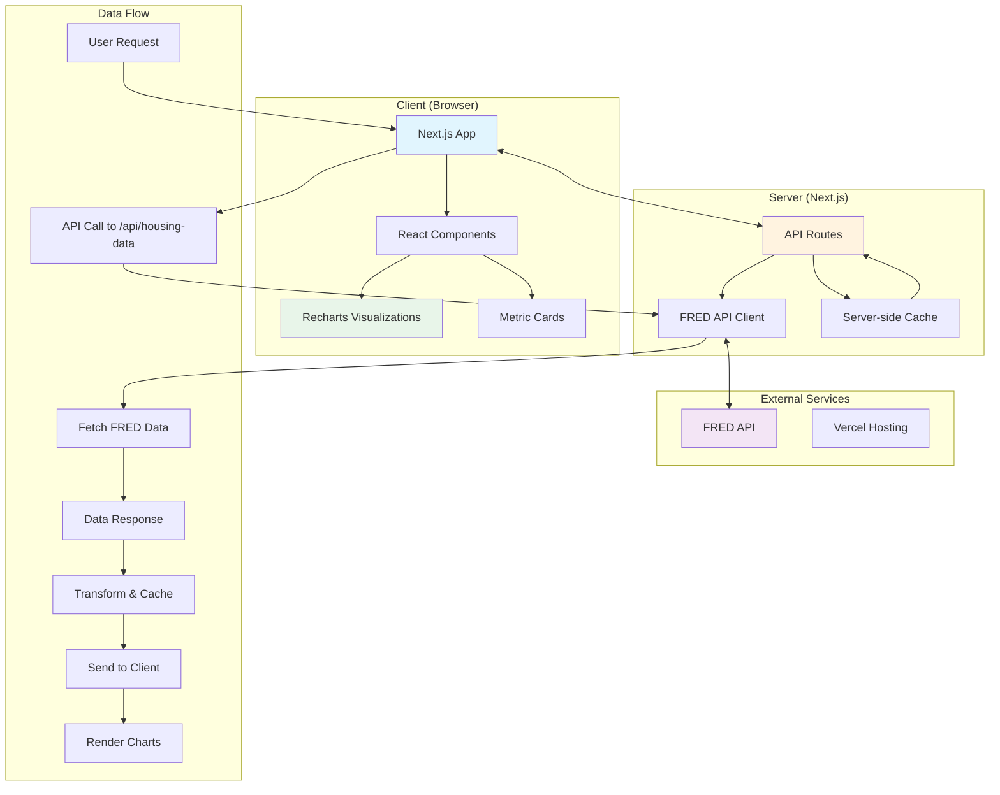

# Houston Housing Dashboard

A real-time housing market analytics dashboard for the Houston-The Woodlands-Sugar Land metropolitan area, built with Next.js and powered by FRED (Federal Reserve Economic Data) API.

[](https://vercel.com/orbbit/v0-app-based-on-prd)
[](https://v0.app/chat/projects/5CUUYHEbtVr)

## 🏡 Overview

This dashboard provides comprehensive insights into Houston's housing market by visualizing key economic indicators including:
- House price trends and indices
- Active housing inventory
- Building permits and construction activity
- Rental market conditions
- Economic indicators (unemployment, CPI)

## 🚀 Quick Start

### Prerequisites
- Node.js 18+ 
- pnpm (recommended) or npm
- FRED API key ([Get one here](https://fred.stlouisfed.org/docs/api/api_key.html))

### Installation

1. Clone the repository:
```bash
git clone https://github.com/yourusername/houston-housing-demo.git
cd houston-housing-demo
```

2. Install dependencies:
```bash
pnpm install
```

3. Set up environment variables:
```bash
cp .env.example .env.local
# Add your FRED API key to .env.local
FRED_API_KEY=your_fred_api_key_here
```

4. Run the development server:
```bash
pnpm dev
```

Open [http://localhost:3000](http://localhost:3000) to view the dashboard.

## 📁 Project Structure

```
houston-housing-demo/
├── app/                    # Next.js App Router
│   ├── api/               
│   │   └── housing-data/  # FRED API integration endpoint
│   ├── layout.tsx         # Root layout with providers
│   └── page.tsx           # Main dashboard page
├── components/            
│   ├── ui/                # Reusable UI components
│   │   ├── button.tsx
│   │   ├── card.tsx
│   │   └── ...
│   ├── housing-chart.tsx  # Main chart component
│   └── metric-card.tsx    # Metric display cards
├── lib/                   
│   ├── fred-api.ts        # FRED API client
│   └── utils.ts           # Utility functions
├── styles/                # Global styles
├── public/                # Static assets
└── CLAUDE.md             # AI assistant instructions
```

## 🏗️ Architecture



## 🛠️ Tech Stack

- **Framework**: [Next.js 15+](https://nextjs.org/) with App Router
- **Language**: [TypeScript](https://www.typescriptlang.org/)
- **Styling**: [Tailwind CSS v4](https://tailwindcss.com/)
- **UI Components**: [Radix UI](https://www.radix-ui.com/) primitives
- **Charts**: [Recharts](https://recharts.org/)
- **Forms**: [react-hook-form](https://react-hook-form.com/) + [Zod](https://zod.dev/)
- **Package Manager**: [pnpm](https://pnpm.io/)
- **Deployment**: [Vercel](https://vercel.com/)

## 📊 Data Sources

The dashboard fetches real-time data from FRED API for the following series:

| Series ID | Description | Update Frequency |
|-----------|-------------|------------------|
| `ATNHPIUS26420Q` | Houston MSA House Price Index | Quarterly |
| `ACTLISCOU26420` | Houston Active Listings | Monthly |
| `HOUS448BPPRIV` | Houston Building Permits | Monthly |
| `CUUSA318SEHA` | Houston Rent CPI | Monthly |
| `HOUS448URN` | Houston Unemployment Rate | Monthly |
| `TXSTHPI` | Texas House Price Index | Quarterly |
| `TXRVAC` | Texas Rental Vacancy Rate | Annual |

## 🔧 Development

### Available Scripts

```bash
# Development server
pnpm dev

# Production build
pnpm build

# Start production server
pnpm start

# Run linting
pnpm lint

# Run tests
pnpm test
```

### Environment Variables

| Variable | Description | Required |
|----------|-------------|----------|
| `FRED_API_KEY` | Your FRED API key | Yes |
| `NEXT_PUBLIC_API_URL` | API endpoint URL (optional) | No |

### Testing

```bash
# Run all tests
pnpm test

# Run tests in watch mode
pnpm test:watch

# Run tests with coverage
pnpm test:coverage
```

## 🚀 Deployment

The application is automatically deployed to Vercel on push to the main branch.

### Manual Deployment

1. Build the application:
```bash
pnpm build
```

2. Deploy to Vercel:
```bash
vercel --prod
```

## 📝 API Reference

### GET /api/housing-data

Fetches aggregated housing data from FRED API.

**Response:**
```json
{
  "housingPriceIndex": [...],
  "activeListings": [...],
  "buildingPermits": [...],
  "rentCPI": [...],
  "unemploymentRate": [...],
  "texasHPI": [...],
  "rentalVacancy": [...]
}
```

## 🤝 Contributing

1. Fork the repository
2. Create your feature branch (`git checkout -b feature/amazing-feature`)
3. Commit your changes (`git commit -m 'Add amazing feature'`)
4. Push to the branch (`git push origin feature/amazing-feature`)
5. Open a Pull Request

## 📄 License

This project is licensed under the MIT License - see the [LICENSE](LICENSE) file for details.

## 🔗 Links

- **Live Demo**: [https://vercel.com/orbbit/v0-app-based-on-prd](https://vercel.com/orbbit/v0-app-based-on-prd)
- **v0.app Project**: [https://v0.app/chat/projects/5CUUYHEbtVr](https://v0.app/chat/projects/5CUUYHEbtVr)
- **FRED API Documentation**: [https://fred.stlouisfed.org/docs/api/](https://fred.stlouisfed.org/docs/api/)

## 🙏 Acknowledgments

- Federal Reserve Bank of St. Louis for providing the FRED API
- Built with [v0.app](https://v0.app) for rapid prototyping
- Deployed on [Vercel](https://vercel.com)
